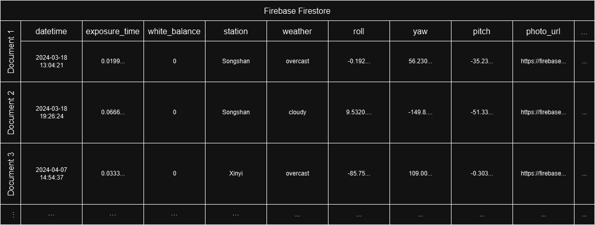

# Cameraless Photography
這是一款不需要使用相機鏡頭，就能根據使用者當前環境狀態取得對應照片的Android應用程式。

## Description
本專案使用具備以下功能的Android裝置  
* GPS全球定位系統
* IMU慣性測量單元
* 網際網路連線功能

拍攝照片時，記錄下列資訊  
* 經緯度
* 方位角
* 仰角
* 時間
* 天氣狀況

使用者可設定參數  
* 快門速度
* 白平衡

根據上述資訊，在專用資料庫的影像中進行檢索，獲得符合條件的影像，以提供使用者如同在當下使用相機拍照的攝影體驗。  
該系統解決了現有影像擷取方法的局限性，例如穿戴式裝置中缺少攝影機以及傳統影像檢索系統的挑戰。  
透過提供一種新的攝影範式，這項研究旨在擴大影像的可能性。

## Methodology

### 一、照片收集系統建立
由於現今的照片資料集都不符合我們的需求，因此我們需要開發一套照片收集系統，此系統必須能夠在拍攝照片的瞬間同時收集地理資訊、慣性資訊、以及天氣資訊，並與照片本身以及照片的EXIF資訊整合。在拍攝照片的瞬間，本系統會讀取IMU測量的慣性資訊、以及EXIF中的經緯度資訊，接著透過政府資料開放平台-自動氣象站氣象觀測資料API取得該位置當下的天氣資訊，最後再將地理資訊、慣性資訊、天氣資訊、照片之EXIF資訊以及照片本身上傳至雲端資料庫。  

了解詳情: [PhotoInfoUploader](https://github.com/ZackChen1140/PhotoInfoUploader)
  
### 二、資料庫建立
此系統所使用到的資料庫分為參數資料庫與照片資料庫。分別由Firebase Firestore與Firebase Storage實現。  
[Firebase官方網站](https://firebase.google.com/)

參數資料庫包含以下資訊，提供照片檢索系統在查詢照片時可能會使用到的所有資訊:  
* 慣性資訊(Roll, Yaw, Pitch)
* 天氣資訊(天氣狀態、測站名稱…)
* 照片的EXIF資訊(時間、曝光、照片長寬、白平衡、經緯度…)

照片檢索系統找到最符合條件的資料後，就會到照片資料庫獲取對應的照片。  

詳細資訊如下圖所示:  

### 三、照片檢索系統建立
照片檢索系統實現了無相機攝影方法，能夠讓使用者不使用相機鏡頭就能取得當下所在位置、時間、天氣、以及裝置朝向的角度的照片。照片檢索系統會收集地理資訊、慣性資訊、天氣資訊、時間、以及使用者設定之拍攝參數，完成上述資料的收集後，就會到資料庫中進行地理位置、天氣狀態、拍攝時段、拍攝季節、以及部分拍攝設定的初步篩選。接著會根據裝置姿態的角度差對照片進行相似度排序，最後到照片資料庫中取得對應的照片，完成無相機攝影的流程。  

## Requirements
### **Hardware**
**Model** Sony XQ-DE72  
**OS** Android 14  
**Chipset** Qualcomm Snapdragon 8 Gen 2  
**RAM** LPDDR5-8GB  
**Sensors** Accel, Gyro, Mag  
**Positioning** GPS, A-GPS, BeiDou, Galileo, QZSS  

### **Software**
**Android SDK** 34  
**Java** 8  
**Android Studio** Flamingo  

### **Libraries and APIs**
firebase-firestore  
firebase-storage 20.3.0  
androidx.exifinterface 1.3.6
glide 4.12.0
opendata.cwa.gov.tw historyapi